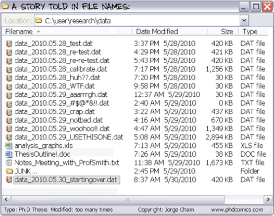
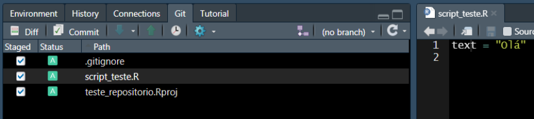

<style>
body {
text-align: justify}
</style>

```{r setup, include=FALSE}
knitr::opts_chunk$set(echo = TRUE)
```

## 1. Introdução ao Controle de Versão



*[Phd Comics](http://phdcomics.com/)*

Quem nunca nomeou um arquivo como "final"? Depois de algumas releituras e correções você salva com outro nome, "final_2". Depois desta versão, alguém analisa e faz observações, e você prontamente salva o arquivo como "final_2_fulano_version", e assim por diante. Imagine que o documento ficou na "geladeira" por alguns meses e você quer retornar de onde parou. Ainda existe a opção de alguém fazer alterações e **não mudar o nome do arquivo**. Neste momento fica muito difícil saber onde parau, ou ainda pode gerar dúvidas de qual é o arquivo mais antigo.  

Nomear arquivos com diferentes nomes é uma maneira intuitiva de se fazer **controle de versão** de arquivos, até pode funcionar para problemas menos complexos. No entanto, quando trabalhamos em grupos de pesquisa, com várias pessoas editando textos e códigos, fica difícil gerenciar o histórico de versões de um arquivo, ainda mais ou vários. Felizmente, hoje existem ferramentas que nos auxiliam no controle de versão, tanto em nossas máquinas quanto em repositórios on line.  

***

## 2. Git

Lançado em 2005, [GIT](https://git-scm.com/) é um software de controle de versões livre. Esta ferramenta permite o rastreio de alterações em qualquer tipo de conjundo de arquivos. O uso do controle de versão permite velocidade no trabalho e integridade de dados, muito indicado em trabalhos em grupo. Ainda, permite a evolução dos projetos de forma não linear, possibilitando a criação de diferentes abordagens sem comprometer os dados originais. Todo o diretório de arquivos onde o Git está operando toda e qualquer mundança é identificada e recuperável.   


Linus Torvalds criou o Git para o desenvolvimento do sistema operacional Linux Kernel. Segundo o próprio autor Git significa [Git - The Stupid Content Tracker] (https://linux.die.net/man/1/git). Existem outros programas de controle de versão, no momento o Git é um dos mais utilizados pela comunidade de desenvolvedores.  

O controle de versão Git assemlha-se a uma árvore, tendo um ramo principal chamado de `master`. O master pode ter ramos paralelos que podem evoluir juntamente com o `master`, estes são chamados de `branch`, e cada um deles pode ter um nome. Cada círculo na figura corresponde a uma versão do diretório. Os ramos `branch` podem ser criados por diferentes pessoas ou por um mesmo usuário. A aplicação prática da criação de ramos é, por exemplo, explorar diferentes tipos de abordagens estatísticas distintas da usada no `master`.  

  

*"Branching" em um repositório Git*      

Imagine que após alguns testes, os usuários que estão trabalhando neste diretório discutem e avaliam que as contribuições podem ser incorporadas ao master. Note que a versão original antes da criação dos `branch`#1 e #2 permanece preservada. Caso nenhuma das abordagens seja ideal, os usuários podem decidir a voltar para as versões anteriores, criar um novo `branch` e explorar outras alternativas. Tudo isso sem comprometer o que já foi realizado.       


***

## 3. Github

  


[Github](https://github.com/) é um serviço de hospedagem na internet para desenvolvimento de software e controle de versão (Git). Em uma definição mais simplificada, pode-se dizer que o Github seria uma rede social onde desenvolvedores compartilham repositórios de arquivos e trabalham em equipe. No Github é possivel seguir e acompanhar perfis pessoais e de organizações, além de acompanhar projetos em desenvolvimento. Cientistas estão cada vez mais usando o Github para compartilhamento de dados e códigos de publicações em revistas científicas.


Diferenças entre Git e GitHub:

| Git                                                  | Github                                               |
|:----------------------------------------------------:|:----------------------------------------------------:|
| É um software                                        | É um serviço                                         |            
| Instalado localmente em sua máquina                  | Está na rede                                         |  
| Usado em linha de comando                            | Apresenta uma interface gráfica                      |
| Gereciar diferentes versões em um repo Git           | Armazenar uma cópia de seu repositório Git           |
| Funcionalidades VCS para gerenciar versões           | Funcionalidades VCS dentre outras                    |
*VCS - Version Control System

***

## 4. Instalando Git-Github-RStudio 

Para poder utilizar o Git, Github e compartilhar projeto realizados com o Rstudio você precisa antes fazer o seguinte:  

1. Instalar em seu o computador o [Git](https://git-scm.com/)
2. Instalar o [R](https://cran.r-project.org/) e RStudio [RStudio](https://www.rstudio.com/)
3. Criar uma conta no [Github](https://github.com/)

### 4.1 Configurando o Git no RStudio

Abra o R Studio e agora vamos configurar o Git para identifdicar você. No RStudio ache a aba Terminal e insira os seguintes comados.

Substitua `USER` e `USER@SEUEMAIL.COM` com o seu. No meu caso seria `silveira.tcl` e `silveira.tcl@gmail.com`; 

```{r, eval=FALSE}

# mostrando a versão do git em seu computador
git --version

# mostrando o caminho das pastas em seu Mac/Linux
which git

# mostrando o caminho das pastas no Windows
where git

# troque USER com o seu nome de usuário do Github
git config –-global user.name USER

# troque USER@SEUEMAIL com o seu email resgistrado no Github
git config –-global user.email USER@SOMEWHERE.ORG

# use git "merge" (default) para resolver possíveis conflitos git "pull" conflicts
git config --global pull.rebase true

# listando "config" para confirmar as variáveis de user.* 
git config --list

```

Agora acesse Tools->Global Options e selecione Git/SVN no menu lateral.
No campo *Git executable* insira o caminho das pastas baseados nos comandos anteriores (Note que eles são diferentes para Mac/Linux `which git` e Windows `where git`).  

Essa configuração parece ser desafiadora em um primeiro momento, mas felizmente este procedimento é bem documentado em [Happy Git and GitHub for the useR](https://happygitwithr.com/rstudio-see-git.html#tell-rstudio-where-to-find-git) se tiver algum problema.

### 4.2 Criando repositório no GitHub (ou REPO)

Após a instalação e configuração do Git/R/RStudio e criar uma conta no Github, o próximo passo é criar repositório no Github.  

Logo após fazer o login no Github você deverá ver a página inicial de seu perfil como abaixo.

  


A esquerda você poderá ver a lista com alguns repositórios e o botão **New**. Clique neste botão para criarmos um novo repositório. Nesta página você vai configurar o seu repositório:

1. Dê um nome para seu repo
2. Especifique se será público ou privado
3. Especifique se você quer adicionar um aquivo README, .gitinore e o tipo de licença (caso seja público. Mais detalhes no link "learn more")

  

Depois de configurado você pode clicar em "Create respository".


Agora que temos o repositório no Github, o próximo passo é cloná-lo e conctá-lo com um projeto com controle de versão no RStudio. Deixe a página acima aberta no seu navegador, pois vamos precisar dela no próximo passo.

### 4.3 Criando projeto no RStudio e conetando e clonando o repo do Github

1. Abra o RStudio e clique em File -> New Project

2. Uma caixa irá abrir, selecione **Version Control**


3. Logo após abrirá em outra janela, selecione Git. Uma nova janela abrirá.


4. Volte ao Github, copie a URL do repo


5. Volte ao RStudio e Cole a URL do repo **Repository URL**


6. Na mesma janela digite  o nome do diretório em **Project directory name**

7. Ainda na mesma janela, selecione a pasta onde colocar o repositório clonado do github no campo 
**Create project as subdirectory of**

Se tudo ocorreu sem problemas até aqui, você clonou o repo do Github em sua máquina. A partir de agora você está apto a realizar mundanças controladas pelo Git e sincronizar tudo no repositório na rede.  

Nas próximas seções veremos alguns comandos básicos de controle de versão no nosso repo recém criado.

## Workflow RStudio/Github

### 4.3 Básico: `commit` e `push` 

Agora podemos criar um script teste para fazermos o primeiro `commit` e `push`.

Observando o painel de **Files** você verá que alguns arquivos foram adicionados. Temos um .gitignore, .Rhistory e teste_repositorio.Rproj. Criando um script e salvando, o painel **Files** ficará como abaixo.


Após a criar e salvar um script teste, opainel **Git** deve estar parecido como o abaixo:


Veja que estão listados alguns arquivos, toda e qualquer alteração salva neste diretório serão listadas neste painel.
Se você selecionar **Staged** você está aprovando a mundança no arquivo para ter controle de versão. **Status** pode ser **A** de "added", **M** significa modificado e ainda não adicionado. 



Com todos os arquivos marcados como **A**, o próximo passo é fazer um `commit`, ou seja, registrar (ou anotar) todas as alterações realizadas. Todo o commit deve ter uma mensagem. Clicando em commit você registra as alterações e pode comentar as pricipais mudanças, por exemplo.   


 

Após isso estamos prontos fazer o `push`, esse comando é similar ao velho e bom email avisando seus colegas que você alterou os arquivos para uma nova versão (mandando link de googledrive, dropbox, etc). Neste caso você está enviando a nova versão para o seu repo no Github. Clicando em `push` você acaba de mandar a versão mais atualizada de seu repo.  

 

Depois de chegar até aqui, confira seu repositório e veja a versão atualizada. Deve estar parecida como a figura abaixo


 


### 4.4 Intermediário: `branch` e `merge`

Os comandos `branch` e `merge` são muito úteis quando queremos testar diferentes caminhos. Imagine que você quer fazer uma figura e segue uma linha de raciocínio. Depois de se deparar com o resultado final, você percebe que poderia seguir um caminho diferente. Para não perder a primeira versão, que está no ramo **master**,  você pode criar um `branch`, uma outra abordagem paralela.  

O comando git no terminal é `git branch`. No RStudio você pode criar um novo `branch` clicando botão de criação de um novo `branch`. 

 


Depois de criar o novo `branch` nomeado "Caminho_2", foram realizadas algumas mudanças no script, fazendo um `commit` e `push` neste ramo. Depois disso, será feito um `merge` incorporando as modificações ao ramo principal **master**. No RStudio é possível somente criar os ramos pela aba Git, para fazer o merge você terá que usar linha de comando no **Terminal**. Note que na interface de `commit`, temos sempre que preencher o campo  **commit message**. Abaixo, em verde, são destacadas as mudanças realizadas. 


Para fazer o merge do ramo "Caminho_2", primeiro você precisa voltar para o ramo **master**. Na aba git do RStudio troque de **Caminho_2** para **master**. Depois disso digite os seguintes comandos no **Terminal**.
```{r, eval = FALSE}
# Fazendo o merge de "Caminho_2" ao "master"
git merge Caminho_2

# Fazendo o "push" para o repositório
git push

```

Você verá na aba **Terminal** algo semelhante a figura abaixo


Voltando para o repositório no Github podemos visualizar a versão atualizada, mais **upstream** do repositório no `master`.

 
 
### 4.5 Avançado: `fork`, `branch`, `pull request` e `merge`

Agora que já vimos como fazer as principais ações usando o **Git** e **Github**, agora podemos executar uma tarefa que consiste na grande vantagem de se usar o Githua: a colaboração.

Para colaborar em um repositório primeiramente você tem copiar os arquivos de algum repositório para o seu **Github**. Essa ação é executada com com o comando `fork`. Por exemplo, se dirija ao [respositório de teste](https://github.com/peld-iloc/teste_repositorio) e localize no alto da página o botão `fork`. Depois escolha onde você gostaria de colocar, escolha seu usuário.

 

No canto esquerdo da página mostrará que o repo está em seu usuário também. 

 

Agora faça novamente os passos descritos em  **4.2 Criando repositório no GitHub (ou REPO)**. Tenha certeza de criar uma nova pasta fora das pastas que você já está trabalhando.


[Github Guides](https://guides.github.com/introduction/flow/)

***

## Github PELD ILOC


## Objetivos

