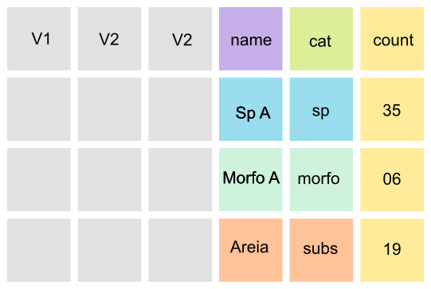

<style>
body {
text-align: justify}
</style>

```{r setup, include=FALSE}
knitr::opts_chunk$set(echo = TRUE)
remotes::install_github("mitchelloharawild/icons")
library(icons)
```


```{r, include=FALSE}
icon_check   <- icons::fontawesome$solid$`check`
icon_times   <- icons::fontawesome$solid$`times`
icon_alert   <- icons::fontawesome$solid$`exclamation-triangle`
```

## 1. Visão Geral

Este documento tem como objetivo registrar os padrões a serem seguidos pelos pesquisadores da rede para a formatação das bases de dados produzidas no âmbito do **PELD-ILOC**. Os formatos e procedimentos aqui descritos são um resultado do **workshop** realizado em **17 de setembro de 2021**.
<br><br>

***

## 2. Padronização dados PELD-ILOC

Os banco de dados do **PELD-ILOC** é constituído por diferentes fontes se subdividindo quanto ao grupo taxômico ou variável amostrada. Basicamente são constituídos pelas últimas versões dos arquivos excel, alguns estão separados por ilhas e outros por grupo taxonômico.

A partir da análise dos arquivos disponíveis verificou-se que alguns ítens não são padronizados e/ou precisam de algum ajuste. A tabela abaixo, lista os grupos de variáveis que precisam ser revisados. Os ítens de verificação são os seguintes:

| Item de verificação             | Ação necessária                                                                                                    |
|:--------------------------------|:------------------------------------------------------------------------------------------------------------------:|
| Coordendas geográficas          | Inspeção de formato (graus decimais) e conferência  de localização                                                 |
| Nomes das Ilhas (Island)        | Inspeção e padronização ortográfica                                                                                |
| Nomes de locais (site)          | Inspeção e padronização ortográfica                                                                                |
| Datas                           | Padronização de formato (DD, MM e YYYY em colunas separadas)                                                       |
| Nomes de variáveis              | Verificar Ortografia e sugestão de nome para facilitar a leitura                                                   |
| Nomes de espécies               | Correção de nomes de espécies (via Worms)                                                                          |
| Adição de aba README            | Criação desta aba                                                                                                  |
| Fotos analisadas                | Verificar nome do arquivo de foto e/ou video e verificar se estão nas pastas                                       |
<br><br>
  
### 2.1 Coordenadas e nomes de *sites*

A conferência de coordenadas e nomes de locais gerou um arquivo de referência. Este arquivo foi obtido com informações pessoais de pesquisadores que estiveram nos locais e com base em publicações do **PELD-ILOC**.A idéia é que este arquivo seja atualizado ao passo que bases de dados sejam revisadas e conferidas.

Arquivo excel com as coordendas confirmadas para cada **site**.  

[peld_iloc_site_coordinates_Thiago_Silveira_2021_08_11.xlsx](https://github.com/peld-iloc/site_coordinates)

A tabela abaixo lista o status de confirmação de nomes de sites e coordenadas do **PELD-ILOC**:

| Grupo                           | Status                                |                          
|:--------------------------------|:-------------------------------------:|
| Peixes Recifais                 | `r icon_check`                        |           
| Bentos (Noronha e Rocas)        | `r icon_check`                        | 
| Grapsus                         | `r icon_times`                        | 
| Bioprospecção                   | `r icon_times`                        |
| BRUVs                           | `r icon_times`                        |
| Colônias de Coral (G.longo)     | `r icon_times`                        |
| Dinoflagelados                  | `r icon_times`                        |
| Interação Peixes-Bentos         | `r icon_times`                        |
| Zooxantelas                     | `r icon_times`                        |
<br>
 
`r icon_alert`Uma dica importante: Na hora da revisão das coordendas é sugerido que se formate esta coluna como **texto**. Isso evita a formatação automática que o **excel** faz caso você esteja usando o padrão de linguagem em Português.
<br><br>
  
### 2.2 Datas

O formato de registro de datas a ser adotado é dia, mês e ano (DD/MM/AAAA) em **colunas separadas**.


### 2.3 Nomes de variáveis

Sugere-se que se use somente letras minúsculas com separação entre palavras usando "_".

Abaixo algumas sugestões de nomes de variáveis:

| Variável                             | Boa opção          | Evitar             |
|:-----------------------------------: |:------------------:|:------------------:|
| Temperatura máxima (graus Celsius)   | max_temp_c         | Maximun Temp (C°)  |
| Precipitação (mm)                    | precip_mm          | prec               |
| Massa (Kg)                           | massa_kg           | Massa (Kg)         |
| Visibilidade horizontal (metros)     | vis_hrz_m          | visib (m)          | 
| Latitude (graus decimais)            | lat_DD             | lat                |

### 2.4 Nomes de espécies

Os nomes das identificações taxonômicas podem ser confirmados utilizando-se funções do pacote **worms** e **rfishbase**. Devem ser revisados os casos de espécies novas.

Abaixo um exemplo de como fazer a validação de nomes de espécies usando o pacote **worms**. O mesmo procedimento pode ser realizado também usando o pacote **rfishbase**. Scripts de exemplo podem ser acessados [neste repositório](https://github.com/peld-iloc/taxonomic_validation) do **PELD-ILOC**.

```{r, eval=FALSE, include=TRUE}
library(worms)
# Criando o vetor de táxons
sp_Names = unique(DF.benthos$name) 

# Passo 1
# Extraindo taxon rank do WoRMS e identificando os nomes inválidos
scNames_rank = wormsbynames(sp_Names, verbose = F)

# Passo 2 - listando os nomes não aceitos
scNames_rank %>% 
  filter( status == "unaccepted")

# Alterando os nomes manualmente para os nomes válidos indicados pelo WoRMS 
DF.benthos = DF.benthos %>%
    mutate(name = str_replace(name, pattern = "favia_leptophylla", replacement = "mussismilia_leptophylla")) %>%
    mutate(name = str_replace(name, pattern = "protopalythoa", replacement = "palythoa")) %>%  

#  Passo 3  - Rodando novamente para confirmar 
sp_Names = unique(DF.benthos$name)
scNames_rank = wormsbynames(sp_Names, verbose = F)

scNames_rank %>% 
  filter( status == "unaccepted")
# Zero issues - ok

```
### 2.4.1 Bases de dados com morfotipos e gêneros/espécies

Alguns bancos de dados possuem classificações em **morfotipos**. Além disso, no caso planilhas da comunidade bentônica, as planilhas apresentam um formato misto de organização, fruto da saída de softwares como o CPCe. As primeiras colunas com variáveis descrevendo os locais de coleta seguido por e repetições de colunas com nomes de espécies com os respectivos valores de cobertura relativa. Essa estrutura dificulta o uso dos dados, pois não há uma coluna **filtro** para separar as classificações em espécie, gênero, areia e frame, por exemplo.  
  
  Com o objetivo de armazenar dados gerados pelo PELD-ILOC somente em planilhas longas (Tidy data; ver item [3.2 Formatos](https://peld-iloc.github.io/Peld_Iloc_Data_WS/dados.html)) são necessários alguns passos para chegar a este formato. Abaixo um guia com uma das maneira de chegar ao formato longo com **rótulo de classificação**. Acesse [neste repositório](https://github.com/peld-iloc/data_exemple_benthic) um set de dados fictícios para rodar o exemplo no R.
  
  
1. No excel, agrupe as colunas de táxons, morfotipos e outras categorias que estiverem disponíveis conforme abaixo. O arquivo de dados de exemplo já está nesta organização.
  

<br><br>
  
2. Após agrupar as variáveis use o script abaixo para reorganizar a planilha em um formato longo com rótulo de classificação.
<br><br>
  
```{r eval = FALSE}
library(tidyverse)

DF.sites_rocas = read_delim("data_Rocas_final_EXEMPLO_SP-MORFO_TEST.CSV",
             na="NA",
             delim = ",",
             skip_empty_rows = TRUE)

# Pivoting rocas data Genus and species

DF.sites_rocas_sp = DF.sites_rocas %>% 
  pivot_longer(
  cols = dragmacidon_reticulata:polymastia_janeirensis,
  values_to = "count"
) %>% 
  add_column(cat = "genus or species") %>% 
  select(-coral:-aborescente_3)
  
# Pivoting rocas data morfotype

DF.sites_rocas_morfo = DF.sites_rocas %>% 
  pivot_longer(
  cols = coral:aborescente_3,
  values_to = "count"
) %>% 
  add_column(cat = "morfotype") %>% 
  select(-dragmacidon_reticulata:-polymastia_janeirensis)

# Pivoting rocas data substrate

DF.sites_rocas_subs = DF.sites_rocas %>% 
  pivot_longer(
  cols = frame:areia,
  values_to = "count"
) %>% 
  add_column(cat = "substrate") %>% 
  select(-dragmacidon_reticulata:-aborescente_3)

DF.benthos_rocas_long = bind_rows(DF.sites_rocas_sp, DF.sites_rocas_morfo, DF.sites_rocas_subs)

write_csv(DF.benthos_rocas_long, "DF.benthos_rocas_long.csv") 
```
<br><br>
  
  
3. Foram criadas três colunas: **name** (nome da espécie ou classe de cobertura), **count** (contagem, cobertura relativa,...) e **cat** (categoria: genus or species, morfotype ou subtrate). Após rodar este script o resultado deve estar como o esquema abaixo.
  

<br><br>
  
 
### 2.5 Arquivo ou aba README

Será adotado pelo PELD-ILOC que todos os arquivos de dados produzidos apresentem uma aba ou arquivo **README**. A adição destas informações, ou **metadados**. é importante compreenssão do que está sendo apresentado no arquivo. 


<br><br>

Neste [respositório](https://github.com/peld-iloc/data_example) você pode acessar dois exemplos de bancos de dados com os **dados** e **metadados (README)**.  
<br><br>
  
### 2.6 Tipos de arquivos

Os dados dos diferentes grupos e variáveis amostradas no **PELD-ILOC** são armazenadas em arquivos **excel**. Os arquivos tipo .xlsx são adequados para o armazenamento dos dados e são de fácil acesso e edição por todos os usuários das rede. Também são aceitos arquivos do tipo .csv, desde de que sigam as orientações a seguir. Além dos arquivos de dados, são armazenados também arquivos de fotos e vídeos.
<br><br>
  
***

## 3. Estrutura dos arquivos

### 3.1 Banco de dados simples

Abaixo um modelo simples de organização de dados para os Peixes Recifais:

 

Ainda no mesmo arquivo, sugere-se fortemente que seja adicionada uma aba **README**.

Caso sejam dados apresentados em formato .txt ou .csv, sugere-se a criação de uma pasta zip com dois arquivos: os dados e o arquivo **README**

  
<br><br><br>

[Arquivos de Exemplo](https://github.com/peld-iloc/data_example)
<br><br>
  
   
### 3.2 Bancos de Dados acompanhados de outras mídias (Fotos e Videos)

Algumas bases de dados são mais complexas e apresentam além de um arquivo com os dados, apresentam também pastas com fotos analisadas em Photoquad ou CPCe.

Abaixo um modelo de organização proposto para Comunidade de Bentos:


<br><br>
  
[Arquivos de Exemplo](https://github.com/peld-iloc/data_example)
<br><br>
  
  
### 3.3 Nomeando arquivos

Considerando os tipos de dados disponíveis, sugere-se que os arquivos sejam nomeados da seguinte maneira:
<br>
 


<br><br><br>
   
Com o objetivo de padronizar os nomes dos grupos, abaixo segue uma sugestão:
<br><br>
  
| Grupo                           | Tipo de informação                    | Sugestão de código para o grupo  |                           
|:-------------------------------:|:-------------------------------------:|---------------------------------:|
| Peixes Recifais                 | Comunidade de peixes recifais         | Peixes_Recifais          
| Bentos                          | Fotoquadrados de Bentos               | Bentos
| Grapsus                         | Marcação e recaptura                  | MR_Grapsus
| Grapsus                         | Censo                                 | Censo_Grapsus
| Grapsus                         | Captura                               | Captura_Grapsus
| Zooxantelas                     | Registro de coleta                    | Zooxantelas
| Interação peixes e Bentos       | Análise de Video                      | IntBentospeixes  
| Bruvis                          | Videos e planilhas                    | Bruvis
| Dinoflagelados                  | Registro de coleta                    | Dinoflagelados
|
<br><br>
  
## 4. Backup dos dados

Os dados enviados de cada grupo estão sendo salvos em um repositório do **Google Drive**. Estes arquivos enviados também são salvos nos computadores dos pesquisadores que estão analisando os dados, obviamente. No entanto, não foi detectado um protocolo formal de como e onde estes arquivos estão sendo salvos com a curadoria do **PELD-ILOC**.


A sugestão é que se aplique a regra do 3-2-1. 

+ **3 cópias diferentes ou versões**: três cópias com versões de diferentes períodos. Por exemplo, atualmente temos uma **versão 1** da pasta com todos os dados enviados. Após o workshop teremos uma **versão 2** com todos o bancos de dados atualizados e conferidos. Depois de tabular todos os dados de uma próxima expedição poderemos ter a **versão 3** temporal do conjunto de dados;

+ **2 tipos de mídias**: Ter a cópia das versões em mais de um tipo de mídia, por exemplo, HD/pen drive e um computador. De preferência que estes não fiquem no mesmo local.

+ **1 cópia em local externo**: Serviços como Google Drive ou DropBox. 
<br><br>
  
  

<br><br><br>
   


