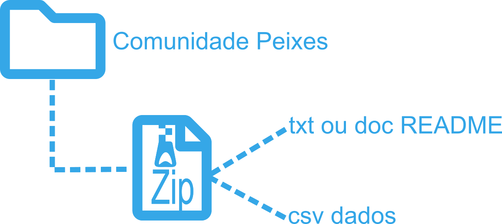
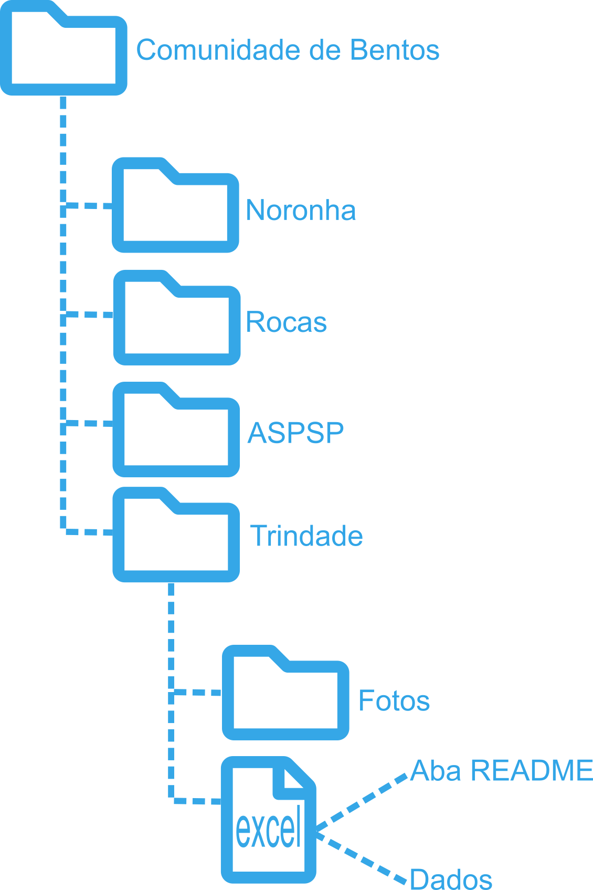

<style>
body {
text-align: justify}
</style>

```{r setup, include=FALSE}
knitr::opts_chunk$set(echo = TRUE)
remotes::install_github("mitchelloharawild/icons")
library(icons)


```


```{r, include=FALSE}
icon_check   <- icons::fontawesome$solid$`check`
icon_check   <- icons::fontawesome$solid$`times`
```

## Visão Geral

Este documento tem como objetivo registrar os padrões a serem seguidos para a formatação das bases de dados produzidas no âmbito do **PELD-ILOC**. Os formatos e procedimentos aqui descritos são um resultado do *workshop* realizado em 17 de setembro de 2021.
<br><br>
  
## Padronização dados PELD-ILOC

Os banco de dados do **PELD-ILOC** é constituído por diferentes fontes se subdividindo quanto ao grupo taxômico ou variável amostrada. Basicamente são constituídos pelas últimas versões dos arquivos excel, alguns estão separados por ilhas e outros por grupo taxonômico.

A partir da análise dos arquivos disponíveis verificou-se que alguns ítens não são padronizados e/ou precisam de algum ajuste. A tabela abaixo, lista os grupos de variáveis que precisam ser revisados. Os ítens de verificação são os seguintes:

| Item de verificação             | Ação necessária                                                                                                    |
|:--------------------------------|:------------------------------------------------------------------------------------------------------------------:|
| Coordendas geográficas          | Inspeção de formato (graus decimais) e conferência  de localização                                                 |
| Nomes das Ilhas (Island)        | Inspeção e padronização ortográfica                                                                                |
| Nomes de locais (site)          | Inspeção e padronização ortográfica                                                                                |
| Datas                           | Padronização de formato (DD, MM e YYYY em colunas separadas)                                                       |
| Nomes de variáveis              | Verificar Ortografia e sugestão de nome para facilitar a leitura                                                   |
| Nomes de espécies               | Correção de nomes de espécies (via Worms)                                                                          |
| Adição de aba README            | Criação desta aba (Ver [Organização de bancos de dados](https://peld-iloc.github.io/Peld_Iloc_Data_WS/dados.html)) |
| Fotos analisadas                | Verificar nome do arquvivo de foto e/ou vide e veficar se estão nas pastas                                         <br><br>
  

### Coordenadas e nomes de *sites*

A conferência de coordenadas e nomes de locais gerou um arquivo de referência. Este arquivo foi obtido com informações pessoais de pesquisadores que estiveram nos locais e conferêncis com publicações. Es

  
  
  
  
  
## Padrão Geral de Organização

### Tipos de arquivos

Os dados dos diferentes grupos e variáveis amostradas no **PELD-ILOC** são armazenadas em arquivos **excel**. Os arquivos tipo .xlsx são adequados para o armazenamento dos dados e são de fácil acesso e edição por todos os usuários das rede. Também são aceitos arquivos do tipo .csv, desde de que sigam as orientações a seguir. Além dos arquivos de dados, são armazenados também arquivos de fotos e vídeos.
<br><br>
  
   

<br><br>
  

### Estrutura de organização de arquivos

#### Banco de dados simples

Abaixo um modelo simples de organização de dados para os Peixes Recifais:

 

Ainda no mesmo arquivo, sugere-se fortemente que seja adicionada uma aba **README**.

Caso sejam dados apresentados em formato .txt ou .csv, sugere-se a criação de uma pasta zip com dois arquivos: os dados e o arquivo **README**

  
<br><br><br>

(link modelo)[ ]

   
### Bancos de Dados acompanhados de outras mídias (Fotos e Videos)

Algumas bases de dados são mais complexas e apresentam além de um arquivo com os dados pastas com fotos analisadas em Photoquad ou Cpce.

Abaixo um modelo de organização proposto para Comunidade de Bentos:


<br><br>
  
(link modelo)[ ]   
  
### Nomeação de arquivos

Considerando os tipos de dados disponíveis, sugere-se que os arquivos sejam nomeados da seguinte maneira:


<br><br><br>
   
Com o objetivo de padronizar os nomes dios grupos, abaixo segue uma sugestão:
<br><br>
  
| Grupo                           | Tipo de dado                          | Sugestão de código para o grupo  |                           
|:-------------------------------:|:-------------------------------------:|---------------------------------:|
| Peixes Recifais                 | Comunidade de peixes recifais         | Peixes_Recifais          
| Bentos                          | Fotoquadrados de Bentos               | Bentos
| Grapsus                         | Marcação e recaptura                  | MR_Grapsus
| Grapsus                         | Censo                                 | Censo_Grapsus
| Grapsus                         | Captura                               | Captura_Grapsus
| Zooxantelas                     | Registro de coleta                    | Zooxantelas
| Interação peixes e Bentos       | Análise de Video                      | IntBentospeixes  
| Bruvis                          | Videos e planilhas                    | Bruvis
| Dinoflagelados                  | Regitro de coleta                     | Dinoflagelados
|
<br><br>
  
## Back up dos dados

Seguindo a regra dos 3-2-1

google drive 

Drop box

Hard drive/computador


<br><br><br>
   


